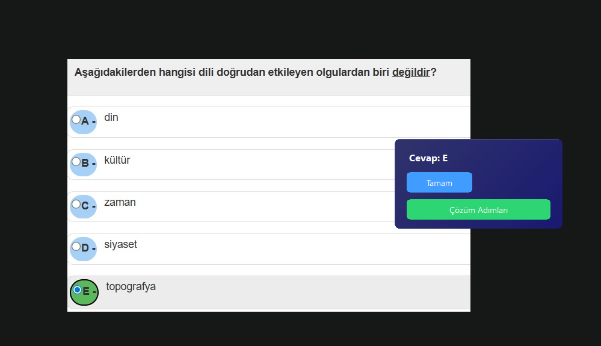
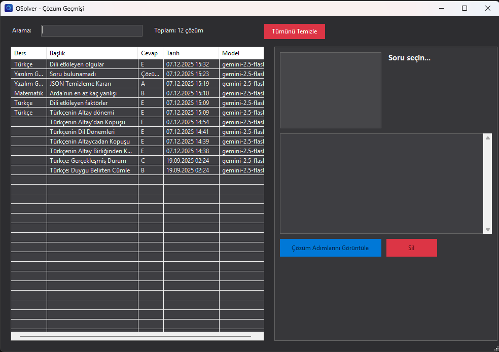
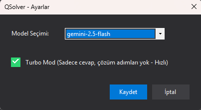
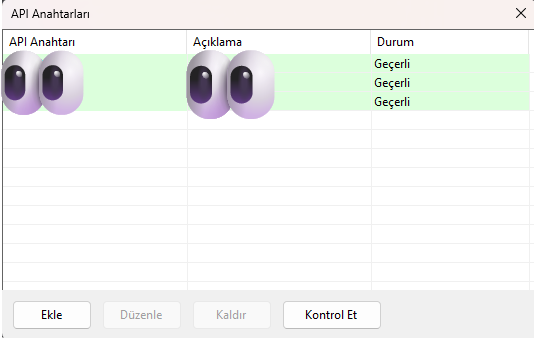

# QSolver

Türkçe | [English](README.md)

<div align="center">

**Yapay zeka destekli soru çözücü**

[](https://github.com/emi-ran/QSolver/releases/tag/v1.6.1)
[](https://github.com/emi-ran/QSolver)
[](https://dotnet.microsoft.com/download/dotnet/8.0)

[📥 v1.6.1 İndir](https://github.com/emi-ran/QSolver/releases/tag/v1.6.1)

</div>

---

## ✨ QSolver Nedir?

QSolver, ekranınızdaki soruları yakalayıp yapay zeka ile çözen bir Windows uygulamasıdır. Soruyu seçin, anında cevabı alın!

<div align="center">

</div>

## 🚀 Özellikler

| Özellik                   | Açıklama                                        |
| ------------------------- | ----------------------------------------------- |
| 📸 **Ekran Yakalama**     | Tıkla-sürükle ile herhangi bir soruyu seç       |
| ⚡ **Turbo Mod**          | Çözüm adımları olmadan hızlı cevap              |
| 📚 **Ders Algılama**      | Otomatik ders kategorisi (Matematik, Fizik vb.) |
| 📜 **Çözüm Geçmişi**      | Tüm çözümlerini görüntüle ve ara                |
| 🔑 **Çoklu API Anahtarı** | Birden fazla API anahtarı yönetimi              |
| 🚦 **Deneme Sınırı**      | Geçici AI yoğunluğunda 3 denemeden sonra bilgi verir |
| 🎨 **Koyu Tema**          | Akıcı animasyonlarla modern arayüz              |

## 📸 Ekran Görüntüleri

### Çözüm Geçmişi

Tüm çözülmüş sorularını görüntüle, ders veya başlığa göre ara:

<div align="center">

</div>

### Ayarlar

AI modelini, Turbo Modu ve kısayol tuşlarını yapılandır:

<div align="center">

</div>

### API Anahtarı Yönetimi

Birden fazla API anahtarı ekle ve doğrula:

<div align="center">

</div>

## 📥 Kurulum

### Gereksinimler

- Windows 10/11
- [.NET 8.0 Desktop Runtime](https://dotnet.microsoft.com/download/dotnet/8.0/runtime)

### Adımlar

1. [Releases](https://github.com/emi-ran/QSolver/releases/tag/v1.6.1) sayfasından `QSolver.exe` dosyasını indirin
2. Uygulamayı çalıştırın
3. Sistem tepsisi menüsünden Gemini API anahtarınızı ekleyin
4. Soru çözmeye başlayın!

## 🎮 Kullanım

1. Sistem tepsisindeki QSolver simgesine **sağ tıklayın**
2. **"Soru Seç"** seçeneğini seçin
3. Soru alanını seçmek için **tıklayıp sürükleyin**
4. Yapay zekanın işlemesini bekleyin
5. Cevabı ve çözüm adımlarını görüntüleyin

**Kısayol Tuşu:** Yakalamak için `Ctrl + Shift + Q`

## 🛠️ Geliştirme

```bash
# Klonla
git clone https://github.com/emi-ran/QSolver.git

# Derle
dotnet build

# Çalıştır
dotnet run

# Release derlemesi
dotnet publish -c Release -p:PublishSingleFile=true
```

## 📄 Lisans

MIT Lisansı - detaylar için [LICENSE](LICENSE) dosyasına bakın.

## 🙏 Özel Teşekkür

Bu projenin fikrini ortaya koyan ve var olma sebebi olan **Bayazıt S.**'ye özel teşekkürler.
