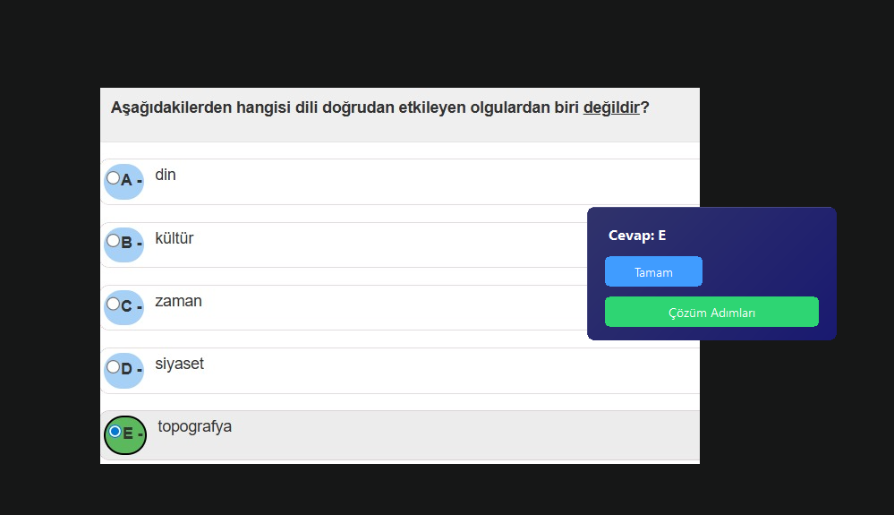
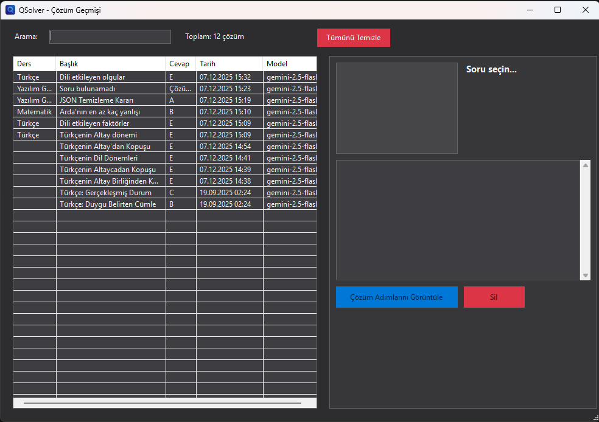
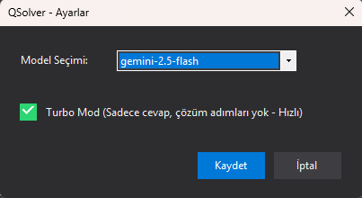
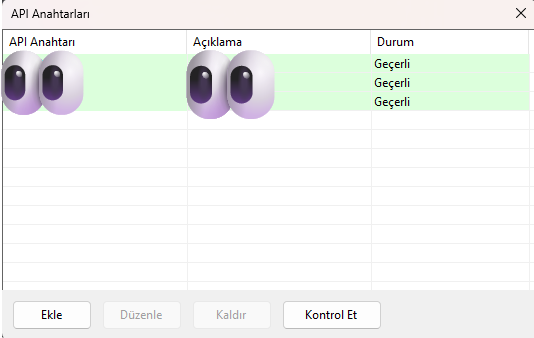

# QSolver

[Türkçe](README-tr.md) | English

<div align="center">

**AI-powered question solver for Windows**

[](https://github.com/emi-ran/QSolver/releases/tag/v1.4.0)
[](https://github.com/emi-ran/QSolver)
[](https://dotnet.microsoft.com/download/dotnet/8.0)

[📥 Download v1.4.0](https://github.com/emi-ran/QSolver/releases/tag/v1.4.0)

</div>

---

## ✨ What is QSolver?

QSolver is a Windows application that captures questions from your screen and solves them using AI. Simply select a region with a question, and get the answer instantly!

<div align="center">

</div>

## 🚀 Features

| Feature                  | Description                                            |
| ------------------------ | ------------------------------------------------------ |
| 📸 **Screen Capture**    | Click and drag to select any question on screen        |
| ⚡ **Turbo Mode**        | Fast answers without solution steps                    |
| 📚 **Subject Detection** | Automatic subject categorization (Math, Physics, etc.) |
| 📜 **Solution History**  | Browse all your previous solutions                     |
| 🔑 **Multi API Key**     | Manage multiple API keys with validation               |
| 🎨 **Dark Theme**        | Modern UI with smooth animations                       |

## 📸 Screenshots

### Solution History

Browse all your solved questions, search by subject or title:

<div align="center">

</div>

### Settings

Configure AI model, Turbo Mode, and keyboard shortcuts:

<div align="center">

</div>

### API Key Management

Add and validate multiple API keys:

<div align="center">

</div>

## 📥 Installation

### Requirements

- Windows 10/11
- [.NET 8.0 Desktop Runtime](https://dotnet.microsoft.com/download/dotnet/8.0/runtime)

### Steps

1. Download `QSolver.exe` from [Releases](https://github.com/emi-ran/QSolver/releases/tag/v1.4.0)
2. Run the application
3. Add your Gemini API key from the tray menu
4. Start solving questions!

## 🎮 Usage

1. **Right-click** the QSolver icon in system tray
2. Select **"Soru Seç"** (Select Question)
3. **Click and drag** to select the question area
4. Wait for the AI to process
5. View the answer and solution steps

**Keyboard Shortcut:** `Ctrl + Shift + Q` to capture

## 🛠️ Development

```bash
# Clone
git clone https://github.com/emi-ran/QSolver.git

# Build
dotnet build

# Run
dotnet run

# Release build
dotnet publish -c Release -p:PublishSingleFile=true
```

## 📄 License

MIT License - see [LICENSE](LICENSE) for details.

## 🙏 Special Thanks

Special thanks to **Bayazıt S.** for the original idea that made this project possible.
